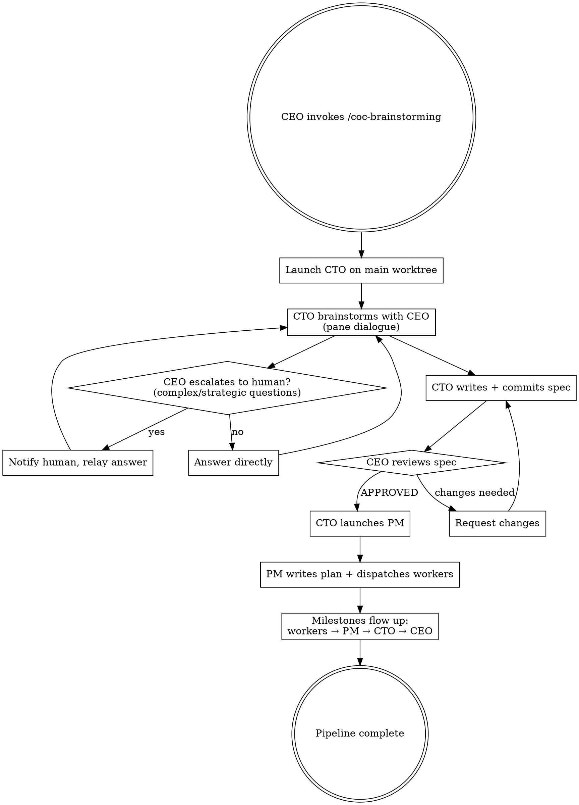

# Chain-of-Command Brainstorming

## Overview

Orchestrates the full idea-to-execution pipeline through the org hierarchy: CEO → CTO (brainstorm → design spec) → PM (implementation plan → parallel worker dispatch). The CEO participates in brainstorming dialogue, gates the design spec, and receives milestone notifications. Everything downstream runs autonomously.

All sessions are tmux sessions driven by `mt-worker.sh` of the `manager` skill, called by the absolute path of that skill's base directory (`<manager base directory>/scripts/mt-worker.sh`, written `$MT` below). Sessions do not message each other: each one writes its status and questions as plain text in its own pane, on a line starting `MANAGER CHECKPOINT: <KIND>`, and its manager reads the pane with `$MT peek <name>` and answers with `$MT send` or `$MT type`.

## Trigger

Invoked as `/coc-brainstorming <topic>` where topic is a short description (e.g., "build a widget embedding system").

## Flow



## CEO Protocol

### Step 1: Launch the CTO

Use the prompt template below. Replace `{ceo_name}`, `{main_worktree_dir}`, `{topic}` and `{topic_slug}`. Save the filled template as a file in the main worktree (for example `{main_worktree_dir}/docs/superpowers/inbox/cto-prompt.md`).

Launch the CTO with `--model opus` and `--permission-mode auto` (an unattended chain: default mode prompts on every Bash call and file write, and nothing answers while the operator sleeps). The command goes as separate arguments:

```
$MT launch cto-{topic_slug} {main_worktree_dir} claude --model opus --permission-mode auto
```

Then deliver the start-up input in this order:

1. `$MT peek cto-{topic_slug}` every 5 to 10 s until the CLI shows its input box (give up after 60 s: `$MT stop`, relaunch once, then escalate). If a first-run trust dialog shows ("Yes, I trust this folder", with "No, exit" highlighted), accept it with `$MT key cto-{topic_slug} Down`, then `$MT key cto-{topic_slug} Enter`.
2. Slash commands go through `type`, one at a time, waiting until the pane is idle between them: `$MT type cto-{topic_slug} "/manager"`, then `$MT type cto-{topic_slug} "/role-cto"`. Never use `send` for a slash command: a pasted leading `/` does not run.
3. The prompt is long, so point to the file: `$MT send cto-{topic_slug} "READ: {main_worktree_dir}/docs/superpowers/inbox/cto-prompt.md"`.

### Step 2: Start the wake loop

```
ScheduleWakeup(delaySeconds=270, prompt="<<autonomous-loop-dynamic>>", reason="check CTO progress")
```

Wake every 60 s or less while the CTO is asking questions, and follow the `manager` skill's wake-interval table otherwise. If a permission dialog or the trust dialog shows in `peek`, answer it with `type`/`key` at the next wake.

### Step 3: Handle brainstorming dialogue

The CTO writes clarifying questions in its pane (`MANAGER CHECKPOINT: QUESTION`). Read them with `$MT peek cto-{topic_slug} 60`. For each question:
- If you can answer from product vision/strategy: answer directly with `$MT send cto-{topic_slug} "<answer>"`
- If it requires human judgment (market positioning, budget, strategic trade-offs): escalate with `$MT notify high ...` (see Human Escalation), wait for the human, relay the answer the same way

### Step 4: Gate the design spec

The CTO reports the spec path + summary (`MANAGER CHECKPOINT: SPEC READY`). Read the spec. Reply with either:
- `APPROVED` — CTO proceeds to launch PM
- `CHANGES REQUESTED: <specific issues>` — CTO revises (max 3 iterations, then escalate to human)

Send the reply with `$MT send cto-{topic_slug} "..."`; if it is long, write it to a file and send `READ: <absolute path>`.

### Step 5: Track milestones

| # | Milestone | Source | CEO action |
|---|-----------|--------|------------|
| M1 | CTO launched | CEO | Start wake loop |
| M2 | Brainstorming dialogue | CTO → CEO | Answer questions |
| M3 | Spec ready for review | CTO → CEO | Read spec, approve or request changes |
| M4 | PM launched | CTO → CEO | Note PM session name |
| M5 | Plan written | PM → CTO → CEO | Informational |
| M6 | Workers launched | PM → CTO → CEO | Note worker count |
| M7 | All workers done | PM → CTO → CEO | Pipeline complete |

## CTO Launch Prompt Template

The CTO's `/manager` and `/role-cto` were already delivered with `type`, so the prompt does not repeat them.

```
You are the CTO. Your manager is the CEO, session `{ceo_name}`. Report status and questions as plain text in your pane, on a line starting `MANAGER CHECKPOINT: <KIND>`; the CEO reads your pane and answers there.

DIRECTIVE: coc-brainstorming: {topic}

This is a chain-of-command brainstorming directive. Your mission:

1. BRAINSTORM: Use superpowers:brainstorming to explore "{topic}"
   - Write clarifying questions in your pane (`MANAGER CHECKPOINT: QUESTION`), then stop and wait for the CEO's answer
   - Do not proceed on ambiguous points before the CEO answers
   - Focus on architecture, components, data flow, testing strategy

2. WRITE SPEC: Write the design spec to docs/superpowers/specs/ and commit it
   - Report the spec path + a 3-5 line summary to the CEO (`MANAGER CHECKPOINT: SPEC READY`)
   - Wait for the CEO to reply with "APPROVED" or "CHANGES REQUESTED"
   - If changes requested: revise, recommit, resubmit

3. LAUNCH PM: After CEO approval, launch a PM session on the main worktree ({main_worktree_dir}):
   - `$MT launch pm-{topic_slug} {main_worktree_dir} claude --model opus --permission-mode auto`
   - Wait until `$MT peek` shows the input box, then deliver `/manager` and `/role-pm` with `$MT type` (never `send`: a pasted leading `/` does not run)
   - Save the PM prompt to a file (directive "coc-execution: <spec-path>", your session name, the CEO's session name) and send `$MT send pm-{topic_slug} "READ: <absolute path>"`

4. WATCH: Track PM progress, relay milestones to the CEO
   - Use the `manager` skill's wake loop (`ScheduleWakeup`, `$MT peek pm-{topic_slug}`)
   - Relay: plan written, workers launched, worker completions, all done

CONSTRAINTS:
- Do NOT skip the CEO approval gate on the spec
- Do NOT launch workers directly — that is the PM's job
- Use `--model opus` for all sessions (no version suffixes)
```

`$MT` in the template is the path of the `manager` skill's `mt-worker.sh`; give the CTO its absolute path in the prompt.

## Human Escalation

```
$MT notify high "Brainstorming needs human input" "CTO asks: {question}. Topic: {topic}. Reply to the CEO session {ceo_name}; CTO session is cto-{topic_slug}."
```

## Failure Recovery

- **CTO crashes:** CEO relaunches CTO with the same prompt + "Check docs/superpowers/specs/ for any partially written spec from a prior session"
- **PM crashes:** CTO relaunches PM with the same directive + "Check for existing plan or worker worktrees from a prior session"
- **Worker crashes:** PM relaunches on the existing worktree (standard PM recovery protocol)
- **Spec rejected 3+ times:** CEO escalates to the human with `$MT notify high ...`
