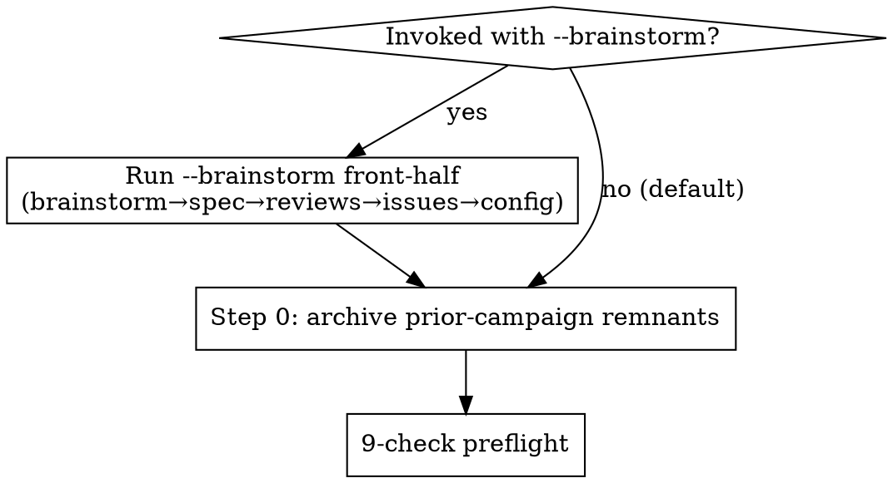

# Megatask Preparation

> Use at your own risk. Published as is, with no support and no promise of updates. This skill was rewritten for this release to run on plain tmux and has not been run end to end in this form.

> `mt-worker.sh` below means `$MT` as defined in the `manager` skill (its base directory plus `/scripts/mt-worker.sh`). Load that skill first.

## Overview

`/megatask` campaigns fail expensively when the manager hits a missing config, a stale plan-issue mapping, or — worst — an invented dispatch mechanism that silently produces normal-effort output at xhigh prices. This skill is the operator-side preflight: it runs interactively BEFORE `/megatask` is typed, walks the user through every gotcha, and exits only when launch is genuinely safe.

**This is Step 1 of a 2-step megatask process.** Step 2 is `megatask:megatask` (the manager runtime). Step 2 HARD-STOPS if Step 1's deliverable (`docs/superpowers/megatask.config.md`) is missing — it refuses to bootstrap the config inline. So this skill is not optional; it is the only path to a launchable campaign.

**This skill is invoked by the OPERATOR's main session, not by the manager.** The manager has its own pre-flight (in `megatask:megatask` SKILL.md §Pre-flight checklist) — that one fires after `/megatask` is typed and after the manager session is born. By then a broken config wastes a whole manager spin-up. Catching it operator-side is cheaper.

**Core principle:** Verify every claim in the config exists and works. Default nothing. Invent nothing.

**Two modes.** Default mode = the 9-check preflight over an existing spec/issues/config. `--brainstorm` mode = run the design front-half first (brainstorm → spec → 3-reviewer pass → issues → generate config + launch prompt), THEN the 9 checks. See §Modes.

**Multi-repo aware.** A campaign may span several repos: the config's `repos[]` registry (one entry per repo, each with its own stack/branch/dev_server/acceptance/main_branch) + a per-issue `Repo:` tag. The preflight validates the issue↔repo mapping and runs the repo-specific checks (baseline, ports, acceptance deps) per repo. Single-repo is the degenerate one-entry / flat-config case. See `megatask:megatask`'s `config-schema.md`.

**Auto-archives prior campaigns.** Before anything, a non-destructive archive sweep moves any config/report/smoke from a DIFFERENT campaign out of the way (§Step 0) so a relaunch never inherits stale state.

## When to Use

- About to launch a fresh megatask campaign (`/megatask` not yet typed).
- About to relaunch after a config edit (hard rule #17 forces a restart; check the new config didn't drift).
- After major repo changes — new plans, retired plans, swapped subagents — and you want to recheck the campaign is still launch-ready.
- Suspect the previous manager dispatched with an outdated config (model swap that didn't take effect, missing subagent definition).

**Don't use:**
- Mid-campaign (manager already running). At that point hard rule #17 forbids overrides — restart the campaign, then run this skill on the restart.
- For non-megatask single-worker dispatches. Plain `megatask:manager` doesn't need this scaffolding.

## Inputs you need before starting

**Default mode:**
1. Path to the campaign config (default: `docs/superpowers/megatask.config.md`).
2. Path to the issue/plan source referenced in the config (issue-file dir, or `docs/superpowers/plans/`).
3. Path to the launch prompt file (e.g. `megatask-prompt-YYYY-MM-DD.md`).
4. GH repo slug if `issue_source.type: gh` (e.g. `owner/repo`).

**`--brainstorm` mode:** just the idea (e.g. `/megatask-preparation --brainstorm "<one-paragraph idea>"`). The spec, issues, and config do NOT need to exist yet — this mode produces them. The repo set is discovered from the design.

## Modes



- **Default** (no flag): assume spec/issues/config exist → Step 0 archive → the 9 checks.
- **`--brainstorm`**: run the design front-half first (it PRODUCES spec/issues/config) → Step 0 archive → the 9 checks. In this mode Check 1 (config exists) and Check 5 (issue↔repo mapping) are satisfied by what the front-half generated, not pre-existing files.

## Step 0 — Auto-archive prior-campaign remnants (BOTH modes, run first)

Never let a previous campaign's artifacts contaminate this one. Determine the **target `campaign.id`** (default mode: from the config being prepared; `--brainstorm`: the new date-slug the front-half will mint). Then:

```bash
TARGET_ID=<campaign.id>
# A config present with a DIFFERENT campaign.id  → prior campaign
# A megatask-report.md whose continuity campaign.id != TARGET_ID → prior campaign
# docs/smoke/ artifacts from the prior campaign
ARCH=docs/superpowers/archive/<YYYY-MM-DD>-<old-slug>/
mkdir -p "$ARCH" && git mv <stale files> "$ARCH"        # MOVE, never delete
git commit -m "chore(megatask): archive prior campaign <old-slug>"
```

- **Non-destructive** (MOVE to `docs/superpowers/archive/<date>-<old-slug>/`). Dated `specs/` + `issues/<date>-<slug>/` dirs are namespaced — leave them.
- **Stale worktrees/branches** from a prior `branch_naming` pattern → **report** + suggest `mt-worker.sh cleanup-merged <repo> <main-branch>` as a LIST only (no `--yes`; run it for real only at campaign closure, after workers are stopped, never right after `worktree-add`); do NOT auto-delete.
- **Same `campaign.id`** (relaunch after a config edit) → **no archive** (same campaign). **Nothing stale** → no-op (idempotent — safe to re-run). This mirrors `megatask:megatask` Step 0.5; running it Step-1-side means the manager finds a clean home.

## `--brainstorm` mode — design front-half (only when the flag is present)

Run BEFORE the 9 checks. Order is fixed: **reviews land on the spec, before issues are derived.**

1. **Brainstorm.** Invoke `superpowers:brainstorming` — explore the idea, propose approaches, converge on a design with the operator (one question at a time / AskUserQuestion for crisp forks).
2. **Write the global spec** → `campaign.home_repo/docs/superpowers/specs/<date>-<slug>-design.md`. One spec covering the whole campaign, including the repo set and per-issue decomposition.
3. **3-reviewer pass on the spec** (parallel subagents — never more than four subagents in flight at once from the operator session; a `--legal` pass makes four): a **quality** reviewer (completeness / factual accuracy vs the real repos / internal consistency), an **ambiguity** reviewer (every requirement interpretable two ways, untyped contracts, missing acceptance criteria), and a **security** reviewer (invoke the `security-review` skill, applied to the design doc — no git-diff ceremony). Fold blocking + should-fix findings back into the spec inline.
4. **Derive the issue files** → `home_repo/docs/superpowers/issues/<date>-<slug>/`, one per dispatchable unit, each carrying a **`Repo:` tag** (matched to the repo set) and full why/what (the *how* is left to the worker per megatask convention) + acceptance bullets. Add a README index.
   **Do NOT pre-write per-issue implementation plans here** — not by hand, not with a fan-out of plan-writer subagents, even when a brief says "one plan per issue". The megatask loop (`megatask:megatask`) has each worker run `superpowers:brainstorming` (interview + design options the manager picks from) → spec draft → `superpowers:writing-plans`, with `/review-spec` at every doc drop (hard rule #21). Plans written operator-side duplicate that work, cost a full campaign's worth of tokens up front, and drift before dispatch. When several issues share names (types, signatures, namespaces, env vars, file ownership), write ONE shared interfaces contract at `docs/superpowers/plans/<date>-<slug>-interfaces.md`, reference it from every issue and from `campaign.interfaces_ref` in the config, and let the workers' plans keep those names. Check 5's plan/SHA pinning applies only to campaigns whose issue source is an existing plans directory.
5. **Generate the config + launch prompt.** Write `docs/superpowers/megatask.config.md` per `config-schema.md` — `campaign.{id,home_repo,spec_ref}`, a `repos[]` entry per **distinct `Repo:` tag** (auto-detect each repo's stack from its `pyproject.toml`/`package.json`), shared `models`/`reachability`/`deploy_guardrails`. Also write `megatask-prompt-<date>.md`. Commit both.
6. **Fall through into the 9-check preflight** below (Checks 1 + 5 now pass against the generated artifacts).

## The 9-check preflight

Run each check in order. Stop and resolve before moving on. The skill is sequential because later checks assume earlier ones passed. **In multi-repo campaigns, the repo-specific checks (1/6/7/9) run once per `repos[]` entry that has a queued issue.**

### Check 1 — Config file exists, parseable, complete

```bash
test -f docs/superpowers/megatask.config.md || { echo "FAIL: config missing"; exit 1; }
grep -E '^- (manager|worker|subagent_implementation|subagent_spec_review|subagent_code_quality_review|subagent_acceptance_smoke):' docs/superpowers/megatask.config.md
```

Expected — every required key from `config-schema.md`:
- **Campaign:** `campaign.id`, `campaign.home_repo`.
- **Shared:** all **six** model assignments (manager, worker, subagent_implementation, subagent_spec_review, subagent_code_quality_review, **subagent_acceptance_smoke**), `issue_source.type`, `deploy_guardrails.forbid_autonomous_deploy`, `reachability.user_reachable`.
- **Per `repos[]` entry** (single-repo flat form: the top-level equivalents): `stack.lint/test/build`, `branch_naming.pattern`, `acceptance_verification.method`, `main_branch`.

If any required key is missing, the manager will refuse to start. Patch the config before continuing. (In `--brainstorm` mode the front-half generated this config — just validate it.)

### Check 2 — Model + effort interview (AskUserQuestion driven)

Parse the current config's model assignments. Show the operator the current values and let them confirm or override.

Use the `AskUserQuestion` tool with one question per role, the current config value as the recommended option (with "(Recommended — current config)" suffix), and 2-3 sensible alternatives. Example for `subagent_implementation`:

```
Question: "subagent_implementation — model to dispatch?"
Options:
- "implementer-xhigh (Recommended — current config)" : project-local custom subagent at .claude/agents/implementer-xhigh.md, opus 4.7 + effort: xhigh per YAML frontmatter
- "opus (default effort)" : standard opus dispatch, no extended thinking
- "sonnet" : cheapest, weaker on SQL / contract correctness
```

Repeat for: `manager`, `worker`, `subagent_implementation`, `subagent_spec_review`, `subagent_code_quality_review`, `subagent_acceptance_smoke`.

If the operator picks anything other than the current default, EDIT the config to match BEFORE continuing. Hard rule #17 forbids mid-campaign overrides; the time to change models is now.

**Multi-repo:** models are shared (one interview). But `acceptance_verification.method` and `dev_server` are **per-repo** — confirm each `repos[]` entry's acceptance method + dev-server setting with the operator (a web repo wants `chrome-devtools-mcp`/`custom-mixed` + a dev server; a CLI repo wants `cli-integration` + no dev server). A wrong per-repo acceptance method dies at that repo's first smoke.

### Check 3 — Referenced subagent definitions exist

Any `subagent_*` value that names a custom subagent (e.g. `implementer-xhigh`) must have a definition file. Check both project-local + user-global locations:

```bash
for name in $(grep -oE 'subagent_[a-z_]+: [a-z-]+' docs/superpowers/megatask.config.md | awk '{print $2}'); do
  case "$name" in
    opus|sonnet|haiku|sonnet-4-6|opus-4-7|haiku-4-5|general-purpose) ;;  # built-ins
    *)
      if test -f ".claude/agents/${name}.md" || test -f "$HOME/.claude/agents/${name}.md"; then
        echo "OK: $name found"
      else
        echo "FAIL: subagent definition missing for '$name'"
        exit 1
      fi
      ;;
  esac
done
```

Read each found file. Confirm the YAML frontmatter has `name:` matching the lookup, `model:` (one of `opus`/`sonnet`/`haiku`), and — if the operator wanted extended thinking — `effort:` (`xhigh` / `max` for opus 4.7).

**Do NOT trust prompt-body invocations.** "ultrathink", "use deep reasoning", and similar phrases in the dispatched prompt are no-ops for subagents (verified empirically: the keyword propagation hook fires only for user→top-level-agent messages, not parent→subagent). The frontmatter `effort:` field is the only working knob.

### Check 4 — Launch prompt file exists and matches config

```bash
ls megatask-prompt-*.md 2>/dev/null | tail -1
```

Open the most-recent launch prompt file. Confirm it:
- References the same config path as Check 1.
- Names subagent_types that match Check 3.
- Does NOT instruct the worker to prepend "ultrathink" or any invented-mechanism string to subagent prompts.
- Tells the worker to dispatch implementers via `subagent_type: "<custom-name>"` (no `model` arg — frontmatter locks it).
- For any UI/frontend issue, mandates that implementer subagents are dispatched with `/frontend-design` (the unconditional default — see `megatask:megatask` worker template + hard rule #12).
- Reviewer subagents default to **opus** (`subagent_spec_review`/`subagent_code_quality_review`/`subagent_acceptance_smoke`) unless an explicit cost-driven override set them to `sonnet`.
- Includes the per-issue loop, hard rules, and closure sweep (those are the manager's standing orders).

If the launch prompt is missing or stale, either regenerate it from the current config or hand-edit it. The operator pastes this verbatim into the manager session.

### Check 5 — Issue ↔ repo mapping (+ plan/SHA pinning where plans exist)

**Issue↔repo (the multi-repo seam — assert first):**
- Every issue carries a `Repo:` tag that matches a `repos[]` entry `name`.
- Every `repos[]` entry is referenced by ≥1 issue (no orphan repo config).
- `campaign.spec_ref` exists and is readable.

```bash
# distinct repos the issues claim:
grep -rhoE '^\**Repo:\**[[:space:]]*[A-Za-z0-9._-]+' docs/superpowers/issues/<slug>/ | awk '{print $NF}' | sort -u
# vs repos[] names in the config — must be equal sets
```

(Single-repo: all issues resolve to the one implicit repo; the `Repo:` tag may be omitted.)

**Plan/SHA pinning (only where `issue_source` uses a plans dir):**
- **gh:** `gh issue list --repo "$REPO" --state open` count == plan-file count; each issue body cites its plan path + a specific plan-file SHA (stale SHA OK via patch-note; a TOTALLY missing SHA means re-pinning is overdue).
- **explicit:** issue-file count == plan-file count; each entry references a plan.

If the mapping is broken, fix before launching: an issue whose `Repo:` matches no `repos[]` entry dispatches into a void; a `repos[]` entry with no issue is dead config; a missing plan dispatches a confused worker. (`--brainstorm` mode auto-satisfies this — the front-half tags every issue and builds `repos[]` from exactly those tags.)

### Check 6 — Clean baseline + dependencies installed (per involved repo)

For **each** `repos[]` entry that has a queued issue (single-repo: the one repo):

```bash
git -C <repos[r].path> fetch && git -C <repos[r].path> status     # tree clean, up to date with origin/<main_branch>
( cd <repos[r].path> && <repos[r].stack.install> && <lint> && <test> && <build> )
```

Also run the `manager` skill's `mt-worker.sh doctor` and require exit 0 (tmux 3.0 or later, git 2.20 or later, bash 3.2 or later).

All green per repo. If any repo is red, the manager will refuse to dispatch into it (hard rule "never start a campaign on a red baseline"). Fix or escalate. Confirm each repo's deps are installed (`uv sync`, `npm install`) so workers don't re-install per task. A multi-repo campaign with 2 green repos and 1 red repo is NOT launch-ready.

### Check 7 — Worker port free (only for repos with `dev_server.enabled`; avoiding each repo's service ports)

Run this check only for repos whose `dev_server.enabled` is set. Workers need their `worker_port` free at dispatch. In multi-repo each repo with a dev server needs its own free worker port, and it must avoid **that repo's live service ports** (e.g. a database, a cache, or other local services).

```bash
# portable (macOS: lsof; Linux: ss). For each dev-server repo's worker_port + each repo's service ports:
for port in <worker_port> <service ports>; do
  lsof -nP -iTCP:"$port" -sTCP:LISTEN >/dev/null 2>&1 && echo "IN USE: $port"
done
```

If any needed port is occupied (a prior campaign's daemon, or a service the repo itself runs), kill the holder or pick a non-colliding `worker_port` per repo (edit config, restart Check 1). Document any port deliberately reserved for a service so a worker never grabs it.

### Check 8 — Reachability + escalation channel matches operator availability

Confirm `reachability.user_reachable` matches reality. If you're stepping away for hours, set `false` + `escalation_channel: notify`. If you can respond within minutes, set `true` to enable pause-on-escalation.

If `user_reachable: false` and neither `reachability.notify_cmd` is set nor you have a habit of watching `megatask-escalations.log`, the manager will fire-and-forget on escalations — the same "escalates into the void" failure. Test the channel first:

```bash
mt-worker.sh notify low test test
# expect a line appended to megatask-escalations.log (and the effect of notify_cmd, if set)
```

### Check 9 — Acceptance method dependencies available (per repo)

For **each** `repos[]` entry's `acceptance_verification.method`:

- `chrome-devtools-mcp`: chrome-devtools-mcp MCP server configured in settings + chrome/chromium installed.
- `custom-mixed`: chrome path AND the CLI probes (curl, jq, pytest) work.
- `cli-integration`: test runners exist.
- `api-http`: curl + jq.

Also verify any `repos[r].acceptance_prerequisites` are runnable (e.g. a local database reachable, a cross-repo CLI on PATH) — these bring up the cross-repo services a repo's acceptance depends on. A repo that passes implementation green but can't run its acceptance dies at that repo's first smoke step.

## After all 9 checks pass

Tell the operator:

> Step 1 of 2 complete — preflight green. You're cleared for Step 2 (the manager runtime).
>
> Campaign: {campaign.id} (home_repo {campaign.home_repo}).
> Repos: {per repo → issues, worker port (dev-server repos only), branch pattern, acceptance method}.
> Reachability: {value}.
> Configured models: {dump of all 6 model assignments + any effort knobs}.
>
> **Step 2 instructions:** open a FRESH Claude Code session, paste the launch
> prompt from `{path}` (which begins with `/megatask`), and hit enter. The
> manager session inherits a verified environment and dispatches the first
> worker without inline config questions.
>
> Do NOT type `/megatask` in THIS session — operator and manager sessions
> must be separate to preserve context budgets. The manager will run for
> hours; you want to monitor it from a context you control.

### If the operator asks YOU to dispatch the manager

Use the `manager` skill's `mt-worker.sh`:

1. `mt-worker.sh launch campaign-manager <home repo path> claude --model opus --permission-mode auto` (an unattended manager must run in `auto` mode: in default mode it prompts on every Bash call, git command and file write, and nothing answers while the operator sleeps; use `--permission-mode default` only when the operator is watching it). In a directory the CLI has not seen, a trust dialog highlights "No, exit": accept it with `mt-worker.sh key campaign-manager Down` then `key campaign-manager Enter`.
2. `peek` until the input box shows. Set the effort: `mt-worker.sh type campaign-manager "/effort xhigh"`, `peek`, expect the effort acknowledgement. Do this BEFORE the start prompt, so the manager's first turn already runs at the configured effort. Record the effort setting in the campaign report.
3. Start it with `mt-worker.sh type campaign-manager "/megatask <config path>"` (slash commands go through `type`; a pasted `READ:` pointer cannot run a slash command).
4. Tell the operator: `tmux -L megatask attach -r -t mt-campaign-manager` to watch.

Never use `send` for slash commands: a pasted leading `/` is not executed.

Still prefer the fresh-session handoff above when the operator has NOT explicitly asked you to dispatch — it sets effort from turn 1 and keeps your context clean.

## Common mistakes

| Mistake | Why it bites | Fix |
|---------|--------------|-----|
| Trust the config without reading the referenced subagent files | `subagent_implementation: opus-xhigh` is meaningless if there's no `.claude/agents/opus-xhigh.md` with `effort: xhigh` in frontmatter | Check 3 reads every referenced subagent file |
| Prepend "ultrathink" to subagent prompts in the launch prompt | Verified no-op. Plain text to the subagent | Check 4 scans for it and rejects |
| Skip the model/effort interview because "config is fine" | Operator forgets they changed a model two campaigns ago and never reverted | Check 2 always interviews; operator can re-confirm in 30s |
| Launch without re-pinning issue bodies to the current plan SHA | Worker reads stale plan; manager finds drift mid-implementation | Check 5 flags missing SHA |
| Forget the worker port is in use because the previous campaign's daemon never shut down | Worker boots, port-binds-fails, retries indefinitely | Check 7 catches it |
| Launch with `user_reachable: false` but no working notify target (`notify_cmd` unset and nobody reads the log) | Manager escalates into the void; issue stalls forever | Check 8 tests the channel |
| Type `/megatask` in the operator session that ran this preflight | Operator context fills with manager state; can't easily monitor or correct | After-state note tells operator to use a fresh session |
| `--brainstorm` and pre-write one implementation plan per issue (eight parallel plan-writer subagents) | Duplicates the worker loop (brainstorm → spec → plan with `/review-spec`), burns a campaign's worth of tokens before dispatch, and the plans drift; also blows the ≤4-parallel-subagents cap | Front-half step 4: issues (why/what/acceptance) + one shared interfaces contract; planning is worker-owned |
| `--brainstorm` but skip the 3-reviewer pass on the spec | The spec ships with the ambiguities + security holes the quality/ambiguity/security reviewers would have caught; every derived issue inherits them | Step 3 of the front-half is mandatory — reviews land on the spec BEFORE issues are derived |
| Leave a prior campaign's `megatask-report.md`/config in place | Manager reads the stale continuity entry point and resumes the WRONG campaign | Step 0 auto-archives any artifact with a different `campaign.id` |
| Multi-repo issue with no `Repo:` tag (or a tag matching no `repos[]` entry) | The manager can't resolve which repo to worktree/merge into — dispatches into a void | Check 5 asserts every issue's `Repo:` maps to a `repos[]` entry |
| One worker port shared by a multi-repo campaign whose repos run their own services | Worker dev server collides with other local services | Check 7 runs per dev-server repo and excludes each repo's service ports |

## Red flags — STOP and re-run from Check 1

- Config edited between Check 1 and Check 9 (re-run all checks).
- Plan/issue files added/removed between Check 5 and launch (re-run Check 5).
- Worker started spawning before launch prompt was finalized (kill, redo Check 4).
- Operator overrode a model in Check 2 but forgot to save the config edit (re-run Check 1 to confirm).
- A config or report with a DIFFERENT `campaign.id` is still present after Step 0 (the archive didn't run — re-run Step 0 before continuing).
- An issue's `Repo:` tag matches no `repos[]` entry, or a `repos[]` entry has zero issues (re-run Check 5).
- `--brainstorm` produced issues but you derived them BEFORE the 3-reviewer pass folded fixes into the spec (re-run the front-half from step 3).

## Cross-references

- `megatask:megatask` — the campaign runtime SKILL (+ its `config-schema.md`, the multi-repo config source of truth). This preparation skill is its operator-side complement.
- `megatask:manager` — the autonomous-loop primitive megatask is built on.
- `superpowers:brainstorming` — `--brainstorm` mode runs this to design the spec before deriving issues.
- `security-review` — the `--brainstorm` 3-reviewer pass invokes this on the spec (no git-diff ceremony).
- `superpowers:writing-plans` — in default mode the per-issue plans/issues should already exist before this preflight runs.
- `superpowers:subagent-driven-development` — workers use this; understand it before launching.

## Why this skill exists

A real 2026-05-26 incident: an operator dispatched a megatask after editing the config to swap implementer subagents from sonnet to opus with "xhigh effort". The mechanism was invented — the worker was told to prepend "ultrathink" to subagent prompts as a fallback when no effort knob was exposed. Empirical A/B test confirmed the keyword propagation hook only fires for user→top-level-agent messages, NOT parent→subagent. Result: opus default-effort dispatches at xhigh prices (10-20× sonnet cost) with no quality lift. The real mechanism — `effort: xhigh` in the subagent's YAML frontmatter via a custom subagent definition file — was discovered an hour later via a docs check. This skill captures the lesson: verify the mechanism by reading the definition file, never trust prompt-body conventions for hidden behavior.
